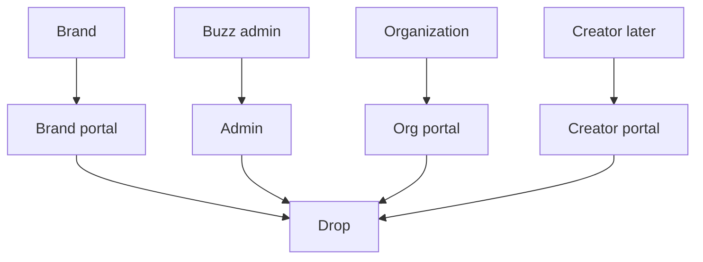
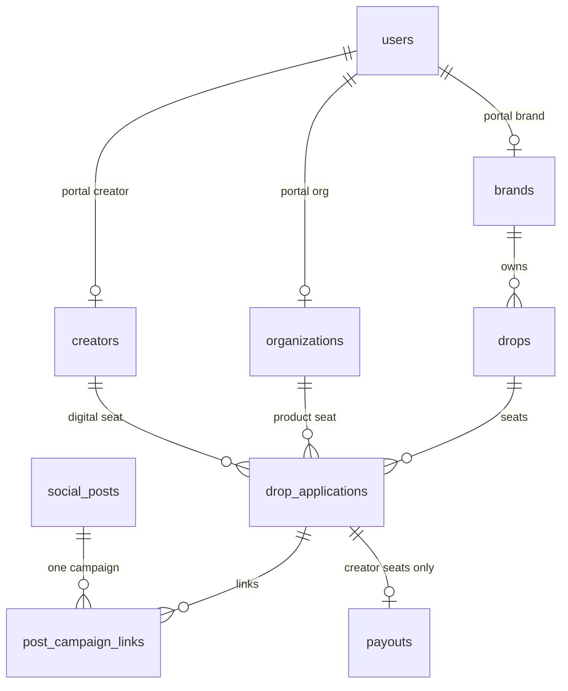
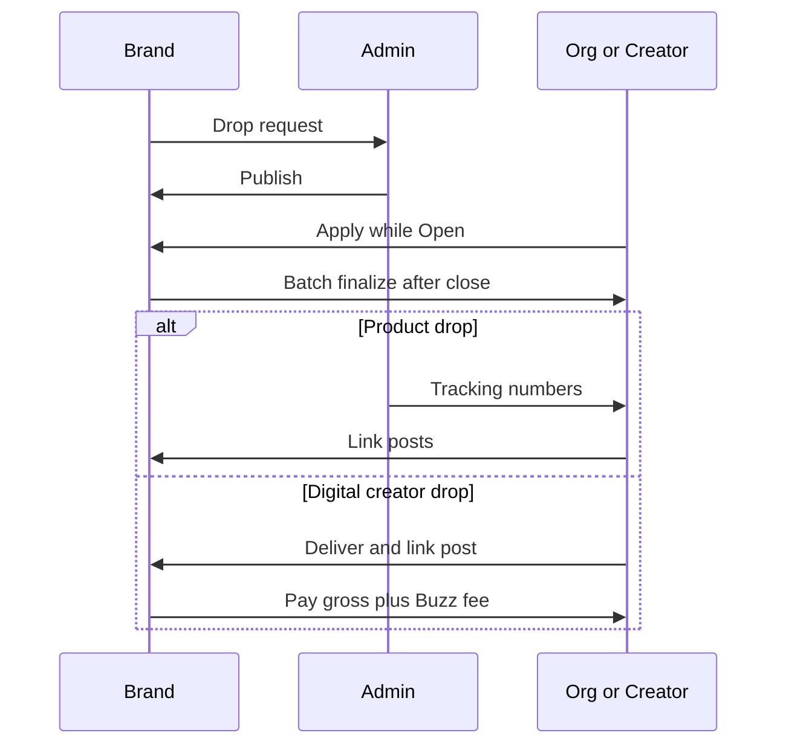

# Campus creators marketplace

Meeting note (2026-09-28). **Not committed behavior.** Promoting this needs an
explicit PRODUCT / UX decision ([`AGENTS.md`](../AGENTS.md) hard stop). Do not
build it in parallel with the current org-to-brand launch.

Related: [`pricing.md`](pricing.md) (today’s doctrine bills brands and keeps
org payouts gross — a creator commission is a different supply-side model),
[`org-social-accounts.md`](org-social-accounts.md) (TikTok as a connected
account, still org-scoped), [`markets.md`](markets.md).

## Decision

Promising **second revenue stream**. Focus stays on **organization-to-brand**
partnerships. Design this as a **later expansion**, and keep today’s
architecture able to support both later. Do not ship a separate product.

## Thesis

Expand Buzz beyond student organizations with a marketplace where **individual
student creators** work directly with brands, on the **same platform** and the
**same brand-facing workflow**.

A brand could run one campaign across organizations and creators without
managing two platforms. Individual creators are an adjacent supply category on
much of the same infrastructure.

Closest comparison to study: **Home From College** — creator discovery,
applications, deliverables, pricing, payment, and campaign management.

## User groups

Buzz would support three groups:

- Students / individual creators
- Student organizations
- Brands

When a brand creates a Drop, it chooses who can participate:

- Organizations only
- Individual creators only
- Both

Otherwise the brand side stays largely the same: create a campaign, define
deliverables, review applicants, and track content and results.

## Student creator experience

Students create profiles and connect social accounts (Instagram, and TikTok if
its API permits it). A profile could show:

- School and campus
- Follower count and engagement
- Audience demographics
- Content category
- Previous collaborations and performance

Unlike organizations, individual creators would be **paid** for producing
content or promoting a product. Payouts, tax information, and payment-method
onboarding are undecided.

Admission would likely be **more selective** than for organizations, with
higher benchmarks on followers, engagement, content quality, or campus
relevance.

## Brand uses

- Paid social promotion
- User-generated content
- Campus ambassador campaigns
- Product launches
- Digital products or services that require no shipping
- Student acquisition campaigns

Especially relevant for companies competing to reach and acquire college
students (examples discussed: Google, Claude, and other AI companies).

## Pricing and Buzz revenue

One proposed model: Buzz takes about a **20% commission** on paid creator
deals.

Longer term, an algorithm or AI system could recommend — or automatically
negotiate — creator rates from:

- Followers and engagement
- Expected reach
- Content quality
- Campaign requirements
- Prior performance
- School or audience demand

This sits in tension with [`pricing.md`](pricing.md), which treats campus
attention as cleared seats rather than an influencer media budget to rake, and
keeps org-side payouts gross. A creator take-rate needs its own pricing
decision; do not assume the org fee model transfers.

## What exists today

| Piece | Today |
| ----- | ----- |
| Supply | Student **organizations** only ([`PRODUCT.md`](../PRODUCT.md)) |
| Brand workflow | Drops, applications, deliverables, content and results tracking |
| Social | Instagram is the org login; TikTok is an unverified handle (see [`org-social-accounts.md`](org-social-accounts.md)) |
| Payments to supply | Orgs are not paid cash for posts under the current model |
| Name | No “Buzz Creators” product |

## Open questions

- How should students receive payment?
- How do we handle tax and contractor requirements?
- How should digital or non-shipped products work?
- What thresholds qualify an individual creator?
- Can TikTok accounts and analytics be connected reliably?
- Should pricing be fixed, negotiated, or algorithmically recommended?
- How much of the org workflow can be reused?
- Should the product be called Buzz Creators?

## Architecture constraint (now)

Do not implement creator accounts, payouts, or a third participant type yet.
When changing org/brand drop flows, avoid locking the model so that a later
participant kind (“org | creator | both”) cannot be added. That is a design
constraint, not a build ticket.

## Research (2026-09-28)

Not a PRODUCT decision. Sources are vendor pages and public terms as of this
date; fee numbers move. This is not legal, tax, or employment advice.

### What the market actually is

Three different businesses get called “campus creators.” They should not be
collapsed into one Buzz feature.

| Kind | What they sell | Examples | Overlap with Buzz today |
| ---- | -------------- | -------- | ----------------------- |
| Paid student work | Brands hire students for tasks, content, or ambassador hours. Payroll is the product. | [Home From College](https://homefromcollege.com/company/pricing) | Low. Buzz does not pay supply. |
| UGC / creator marketplaces | Brands buy videos and usage rights from a large creator pool. Campus is a filter, not the wedge. | [SideShift](https://sideshift.app/plans/brands), [Collabstr](https://collabstr.com) | Low–medium. Same “brief → deliverable → metrics” shape, different supply. |
| Campus programs | Sampling, org activations, ambassador field teams, college media. | [Her Campus Trendsetters](https://www.hercampusmedia.com/brands/campus-trendsetters), SocialLadder, CampusThreads | High on **orgs and sampling**. They are the competitive set for Buzz as it is. |
| Enterprise influencer CRM | Search, contracts, seeding, payouts for a brand’s own creator program. Not campus-native. | GRIN, Aspire | Workflow analog only. Custom SaaS, not a campus marketplace. |

NIL marketplaces (Opendorse and similar) are a regulated athlete lane. Home
From College advertises college-athlete / NIL work. Buzz should not inherit
that by letting “any student creator” include athletes without a separate
decision.

### Home From College (closest named comparison)

H\FC is a **career and gig platform for young people**, not an org marketplace
and not college-only. Their own student guide says applicants need not attend
a specific college, and high-schoolers, recent grads, and non-students use it
([how it works](https://homefromcollege.com/resources/how-it-works/hfc-for-studentsin-30-seconds)).

Motion: student profile (they push a resume / “B\Card”) → apply to a **GIG**
with short interview answers → brand messages and hires → contract, tasks,
content, and pay happen in their portal
([apply guide](https://homefromcollege.com/resources/how-it-works/apply-to-gigs)).

Pricing, from their pricing FAQ and [client terms](https://homefromcollege.com/terms):

- SaaS seat cap, separate from pay. Public FAQ: Starter **$49/mo** for 5
  participants, Growth **$99/mo** for 10. Pricing page also shows a **$999**
  tier. Enterprise is custom.
- **Up to 20% service fee on worker compensation, paid by the brand on top.**
  Their example: a $100 payment to the student is invoiced at $120. The
  student receives $100. Subscription fees do **not** cover compensation.
- Published pay bands: content **$75–$100/video**, one-time gig **$250–$400**,
  monthly **~$800**, ambassador **~$30/hr**. They require at least federal
  minimum wage.
- They own payroll: time tracking, disbursement, one monthly invoice.
- Brands get content **in perpetuity**, including paid-media usage, via their
  boilerplate or the brand’s own contract
  ([brand FAQ on their companies page](https://homefromcollege.com/companies)).

Forbes (March 2026) describes the pitch as **pay for participation** — not
influencer attention and not affiliate commission — with brands such as Adobe,
Poppi, and Uber.

**Read for Buzz:** the “20%” in the meeting note matches H\FC’s number, but
H\FC’s 20% is a **brand invoice surcharge on gross student pay**, stacked on a
subscription. It is not a cut taken out of the creator’s rate, and it is not
how they monetize org product drops. Copying “20% of creator deals” without
saying who pays it will collide with [`pricing.md`](pricing.md).

### Adjacent competitors

**SideShift** ([brand plans](https://sideshift.app/plans/brands),
[payouts](https://sideshift.app/platform/payments)). Started as campus gigs at
Wisconsin; now a general UGC engine (they claim 700k+ creators and 1,500+
brands on the creator page). Brands pay **$299 / $499 / $999 per month** for
a hire cap. Creator budget is separate. They advertise **no payment-processing
fee**, payouts in about 3 business days, and **W-9 / 1099 handling**. Contracts
and usage rights (including paid ads on higher tiers) are in-app. Tracking
includes TikTok, Instagram, YouTube, and Facebook. This is the “software that
runs creator campaigns” Buzz would be rebuilding if creators became the
product.

**Collabstr.** Self-serve packages. Third-party reviews of their pricing page
(2026) report about **10% from the brand** (5% on a premium plan) **plus 15%
from the creator payout**, escrow until approval. That double dip is what
creators price around. GRIN’s public compare page says GRIN takes **no
percentage of creator-driven revenue** and sells software instead.

**Her Campus Trendsetters** is the org-adjacent analog, and it is a **managed
media program**, not a portal brands operate themselves. They publish
**18,000+ members**, **11,000+ student-org leaders**, **1,600+ campuses**,
**97% women**, plus a Sampling Squad that pushes product through the student
organizations those members already belong to. That is Buzz’s current wedge
(orgs, gifting, on-campus distribution) sold as a service, with individual
students as the recruitment layer on top of orgs — not a replacement for orgs.

SocialLadder and CampusThreads sell **ambassador operations software**
(tasks, proof, rewards, campus reps). Brands own the roster. They are not
marketplaces of pre-cleared orgs.

### TikTok

Official [Login Kit](https://developers.tiktok.com/docs/en/login-kit-overview)
plus [user info](https://developers.tiktok.com/doc/tiktok-api-v2-get-user-info)
can return the **connected user’s** follower count, likes, and video count
(`user.info.stats`), after app review for those scopes. It does **not** look
up arbitrary accounts, and it does **not** provide audience demographics
(age, gender, geography). Access tokens are short-lived and need refresh.
Buzz already marks TikTok OAuth out of v1 ([`PRODUCT.md`](../PRODUCT.md) §11;
[`org-social-accounts.md`](org-social-accounts.md)).

Instagram is the opposite shape: Buzz already binds a professional account and
refreshes follower count ([`PRODUCT.md`](../PRODUCT.md) §4.3). Audience
demographics are a Graph insights add-on for that connected account, not
something TikTok’s public API matches. A creator profile that promises
“audience demographics” can be honest for Instagram and only approximate for
TikTok.

### Where it blends

Reuse the **brand campaign spine**, not the org record:

- Drop request → admin publish → apply window → batch finalize → linked posts
  → refreshed metrics → UGC library ([`PRODUCT.md`](../PRODUCT.md) §5–§8).
- One post linked to at most one campaign (§4.2).
- Optional `total_product_units` already allows a drop with no unit budget
  (§4.1). Empty shipment lists are valid (§5.2). That is the only current
  hook for digital or non-shipped offers.
- Public `/d/:id` is already “supply discovers one campaign without the feed.”
- Brand filters (category, region) are the right *idea* for “who can apply”;
  they are the wrong *vocabulary* (sorority, fraternity, sports, academic club).

The clean blend is a **second supply type on the same brand account**, used
when the job is paid content or student acquisition and nothing has to ship.
AI / software companies in the meeting note fit that case. The brand still
requests a drop; Buzz still mints it; the brand still batch-finalizes.

Do **not** model a creator as an `organizations` row. Applications, posts,
notify, intents, and shipments are all `org_id`. `portal_role` is only `org`,
`brand`, or `admin`. A creator is a new participant, later.

### Where it clashes

**Identity.** A real user is exactly one portal, Brand or Organization
([`PRODUCT.md`](../PRODUCT.md) §1, §3.1). The bound Instagram must be the
**org’s** Business or Creator account, explicitly not a member’s personal
profile (§6.1.1). `.edu` and Instagram username are unique per user. An
officer cannot also be a paid personal creator on the same email or the same
Instagram without a new identity rule. There is no membership table: the org
login *is* the org.

**The seat.** A spot is one organization (§2, §4.1). One non-denied
application per org per drop. Mixing “10 org boxes of product” and “10 paid
creator videos” in one `capacity_total` makes finalize, units, and the feed
spot line mean two things. If both supplies ever share a campaign, they need
**separate caps**, not one dropdown on the same integer.

**Fulfillment story.** Apply requires a US shipping address (§6.1). Publish
puts the brand tracker on **Awaiting Products** (§5.2). Org campaign stage 2
is “Accepted — Awaiting product.” A digital creator deal has no ship-to and
no product stage. Forcing creators through that tracker teaches brands the
wrong status. A no-ship drop needs its own stage list (accepted → live →
finished), not a blank tracking number on Awaiting Products.

**Money.** There is no payout, tax, or contractor implementation in the
backend. Orgs are compensated with product and perks, not cash. H\FC’s whole
product is the opposite: they are the payroll layer, and they talk about
workers and minimum wage. Paying individual students pulls in W-9 / 1099-NEC
territory (US, generally when a payer’s year-total to a contractor crosses
the IRS threshold), age rules, and possibly “this is employment” if Buzz sets
hours and shift-like tasks the way H\FC gigs do. Content buys (a video for a
fee) are a narrower contractor shape than hourly ambassador shifts. Either
way this is counsel work, not a schema field.

**Pricing doctrine.** [`pricing.md`](pricing.md) says bill brands and keep
supply payouts gross. H\FC matches that (student gets $100, brand pays $120).
Collabstr does not (creator-side 15%). A Buzz creator fee should be a **brand
surcharge on gross creator pay**, on top of whatever the brand already pays
Buzz for org drops — not a rake inside the student’s rate, and not a replacement
for the org seat fee. Algorithmic rate negotiation is what SideShift-class
tools market; it is not required to reuse the drop workflow.

**Cannibalization.** Buzz’s scarce asset is a cleared **org on a campus** with
a shared audience. Individual creators are abundant, and SideShift, Collabstr,
GRIN, and H\FC already recruit them. If a brand can fill a drop with cheaper
personal accounts, they will skip the org. Her Campus avoids that by using
students *and* their orgs (sampling squad). A mixed drop that lets brands
choose “creators only” on day one trains them off the wedge.

**Trust and rights.** Org admission is “real org, .edu, professional IG, Buzz
review.” Creator admission in the meeting note is “higher follower and
engagement bars.” Those are different products on one roster. Paid creators
also make usage rights the thing being sold. Buzz’s UGC rights are still an
open TODO (§5.3.1). H\FC’s default is brand ownership in perpetuity, including
whitelisting as ads. Shipping creator deals before that TODO is decided means
the brand paid for content Buzz cannot say they may reuse.

**Name.** “Buzz Creators” describes the expansion and also hides the org
product. Prefer keeping **Buzz** as the brand and treating creators as a
participant type, not a second product name, until there is a real line of
business.

### Practical sequence (still parked)

1. Keep building org drops. Do not add a creator role, payouts, or a
   participant-kind field yet.
2. When touching drops, leave room for a later no-ship path (stage list and
   ship-to are org assumptions, not laws of campaigns).
3. If this is promoted later, first campaign shape is **creators only, no
   shipment, brand pays creator gross + Buzz fee**, on the existing brand
   portal. Do not mix org seats and creator seats in one capacity.
4. Study H\FC for payroll and rights, SideShift for in-app payouts and 1099s,
   Her Campus for how individuals sit *on top of* orgs without replacing them.

## Platform shape (parked)

[`ARCHITECTURE.md`](../ARCHITECTURE.md) stays the as-built system. This section
is the later shape only. Do not migrate toward it until a PRODUCT decision.

Buzz is one platform: one API, one SPA, one admin, one brand relationship.
Organizations and creators are two supply doors into the same Drop. They are
not two products and not two rows in `organizations`.

### What stays

Brand login, admin login, JWT refresh, View as, drop request → admin publish,
apply window, batch finalize, one post linked to one campaign, metric refresh,
UGC library, org apply, org Instagram bind, org feed, My Campaigns, shipments,
and the org tracker (`awaiting_products` → `drop_active` → `drop_finished`).

### What gets added

| Layer | Addition |
| ----- | -------- |
| Identity | `users.portal_role` gains `creator`. New `creators` profile, 1:1 with that user, sibling of `organizations` and `brands`. |
| Login | Same Instagram Business Login machinery. The bound account is the student’s own professional account. Returning login is that Instagram. |
| Drop | A fulfillment kind (`product` or `digital`) and who may apply (`orgs`, `creators`, or both). Product drops keep today’s tracker and org capacity. Digital drops use a shorter tracker and a creator cap. |
| Seat | `drop_applications` gains `creator_id`. A row has an org or a creator, never both. Unique active application per participant per drop. |
| Posts | `social_posts` gains an owner that can be a creator. Same uniqueness on `(owner, platform, external_id)`. `metric_sync` refreshes creator tokens the way it refreshes org tokens. |
| Money | New payout context, only on creator seats: agreed fee, brand charge (creator gross + Buzz fee), payout status, and a connected payout account (tax identity lives at the processor, not in Buzz columns). |
| Surfaces | Creator portal (feed, campaigns, profile, payout status). Brand drop view grows a creator roster when the drop allows creators. Admin gains a creator-review queue. Marketing gains a creators page when the line exists. |

Org-only screens do not list creator drops. Creator screens do not list product drops meant for organizations. A mixed drop, if it ever exists, is two rosters and two caps under one title, one window, and one metrics rollup.

### Same person, two supply roles

The org login is the chapter Instagram. A creator login is a personal professional Instagram. Those are different accounts and can both exist. The collision is `users.edu_email`, which is unique today and is the org’s contact inbox. A later creator launch scopes email uniqueness by portal, or moves the org contact address onto `organizations`. It does not merge the two sessions. One authenticated user still has one portal. View as already switches portals for admins only.

### Diagrams

Three are enough. More than this becomes a second PRODUCT.

Who uses the platform:

How a seat attaches:

How the two drop kinds run:

### Leave room now

Leave the org schema as it is. A later migration adds `creator_id` and a check that each application has one owner. Empty shipment lists and nullable unit budgets already exist; they are not a digital-drop mode. Do not add an unused `creator` role, payout tables, or a participant-kind column ahead of the decision.

## Frontend on branch

Branch `prototype/campus-creators` builds the creator frontend on in-memory hooks in `frontend/src/api/hooks/creator/`, shaped so the backend only replaces the hook bodies. Public: `/for-creators` and `/creators/apply`. Status-gated: `/creators/verify`, `/creators/pending`, `/creators/connect`, then `/creators/feed`, `/creators/campaigns`, and `/creators/profile` once active. The brand roster and admin review/payout queues are components, previewed at `/admin/demo/creator-roster` and `/admin/demo/creator-review`. The admin **Demo directory** (`/admin/demo`) opens any creator state as a sample creator on the mock data. It is not PRODUCT.
